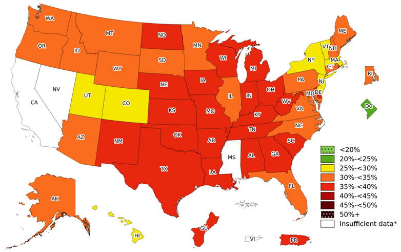
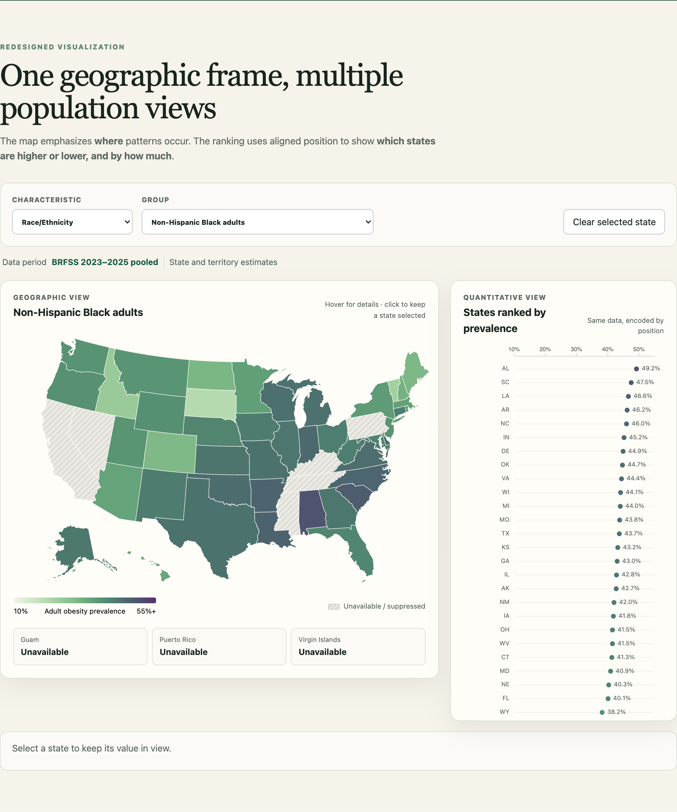

# Visualization Critique and Redesign Report

**Guyun (Alicia) Lu**

## 1. Original Visualization and Context

The Centers for Disease Control and Prevention (CDC) *Adult Obesity Prevalence Maps* present state-level estimates from the Behavioral Risk Factor Surveillance System (BRFSS), a telephone survey of U.S. adults. Their main message is that adult obesity is widespread, but its prevalence and geographic patterns vary across states and population groups. Because the page is positioned “For Public Health,” its primary audience is public-health practitioners and policymakers. Researchers, journalists, students, and interested members of the public are reasonable secondary audiences. The main tasks are to locate states, identify broad prevalence levels, recognize geographic clustering, and inspect patterns for demographic groups.

The current page combines related but not identical time periods. Overall and age estimates use BRFSS 2025, whereas race/ethnicity estimates pool BRFSS 2023-2025. Education is different again: the page currently reports four national 2025 estimates but provides no state-level education maps or tables. These distinctions matter when interpreting comparisons.

**Figure 1. Original CDC Adult Obesity Prevalence Maps.**

## 2. Critique

The original has two important strengths. First, geographic position is an appropriate channel because regional clustering is meaningful. Familiar state shapes let viewers quickly see where high or low prevalence areas are concentrated. Second, repeated state geometry and ordered prevalence colors create a consistent visual language. Once a viewer understands one map, the same spatial organization and light-to-dark encoding make later maps individually understandable.

These strengths support spatial overview tasks, but the design is less effective for comparison. First, separate maps require scrolling. To compare two groups, a viewer must navigate between distant views and remember earlier colors and locations. This raises working-memory demands and makes differences easy to overlook. Second, subgroup exploration is cumbersome. Moving among age or race/ethnicity populations should be a direct analytical action, but the page structure turns it into repeated navigation through static sections. The maps remain understandable alone, yet the interface does not efficiently support asking how the pattern changes when the population changes.

Third, choropleth color is weak for precise quantitative comparison. Ordered color works well for detecting broad spatial patterns, but viewers cannot reliably judge small numerical differences from color intensity. Aligned position is more accurate for comparing magnitude. Geographic area also creates unequal salience: large states occupy more visual space even though land area is not the measured variable. Thus, the original is effective for “where?” but weaker for “which state is higher, and by how much?”

## 3. Redesign Rationale

The first redesign decision replaces repeated static maps with one persistent interactive map controlled by characteristic and subgroup selectors. This directly reduces scrolling and memory demands: geography stays fixed while the selected population changes. It preserves the original’s most useful feature, the spatial view, rather than replacing it.

Second, demographic controls are paired with a dynamic period label. Selecting overall or age shows BRFSS 2025, while race/ethnicity shows pooled BRFSS 2023-2025. Keeping the period next to the controls prevents the interface from implying that every demographic comparison uses the same observation window. Education is explicitly presented as a national summary instead of inventing unavailable state values.

Third, the redesign adds a linked sorted dot plot and exact-value tooltip. The map answers, “Where are the geographic patterns?” The dot plot answers, “Which states are higher or lower, and by how much?” Linked hover and persistent selection connect the same state across both views, while the tooltip supports exact lookup. Suppressed observations receive a patterned map fill and are labeled unavailable; they are never interpreted as zero.

**Figure 2. Redesigned interactive obesity visualization with demographic controls and linked state comparison.**

## 4. Original vs. Redesign and Limitations

The redesign makes demographic exploration faster because users change populations without leaving the shared geographic frame. It also makes state ranking and exact-value lookup easier through aligned dots, labels, and tooltips. Patterned missing-value encoding distinguishes unavailable estimates from measured low prevalence. Together, the views divide labor: the map maintains context, while the ranking improves quantitative comparison.

The redesign does not remove limitations in the source data. BRFSS relies on self-reported height and weight, and survey estimates contain uncertainty. Some subgroup estimates are suppressed, and periods differ across demographic dimensions, so comparisons are descriptive rather than perfectly controlled. Choropleth area bias also remains, although the dot plot mitigates it. Finally, education remains national-only because the CDC page does not currently publish state-level education maps or tables.

## References

Centers for Disease Control and Prevention. (2026). *Adult Obesity Prevalence Maps*. <https://www.cdc.gov/obesity/data-and-statistics/adult-obesity-prevalence-maps.html>

Centers for Disease Control and Prevention. (2026). *Behavioral Risk Factor Surveillance System*. <https://www.cdc.gov/brfss/>

Centers for Disease Control and Prevention. (2026). *Adult obesity prevalence data tables: 2025 overall and age estimates; pooled 2023-2025 race/ethnicity estimates* [Data sets]. Downloads linked from the *Adult Obesity Prevalence Maps* page.
